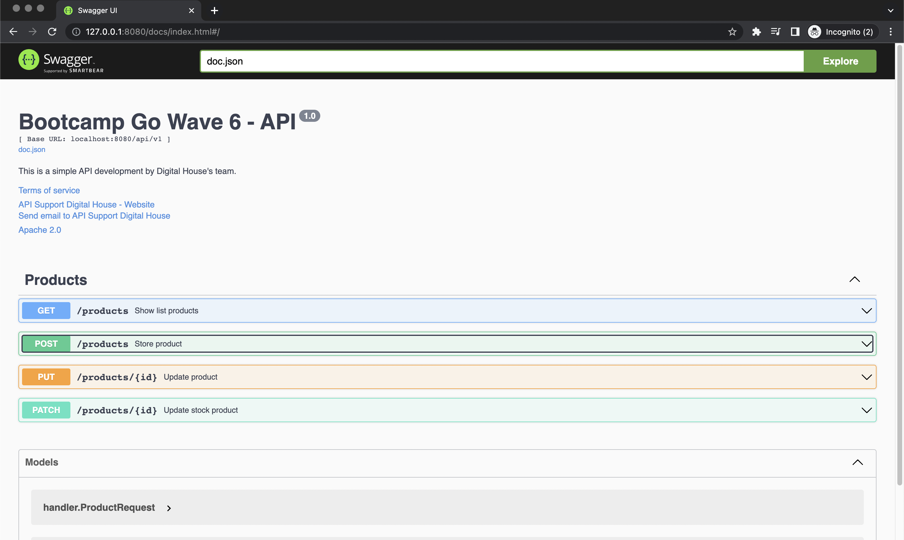

# Ejercicio 1

## Enunciated *_Test Unitario GetAll()_*

Generar un Stub del Store cuya función `“Read”` retorne dos productos con las especificaciones que deseen. Comprobar que `GetAll()` retorne la información exactamente igual a la esperada. Para esto:

1. Dentro de la carpeta `/internal/(producto/usuario/transacción)`, crear un archivo `repository_test.go` con el test diseñado.

## Run 

- Estructura de directorios, podemos observar el directorio generado `docs/` donde almacena la documentación

```bash
$ tree
.
├── README.md
├── cmd
│   └── server
│       ├── handler
│       │   └── handler.go
│       └── main.go
├── create_products.json
├── docs
│   ├── docs.go
│   ├── swagger.json
│   └── swagger.yaml
├── go.mod
├── go.sum
├── internal
│   ├── domain
│   │   └── product.go
│   └── products
│       ├── repository.go
│       └── service.go
├── patch_products.json
├── pkg
│   ├── store
│   │   └── file.go
│   └── web
│       └── response.go
├── products.json
└── update_products.json

10 directories, 17 files
```

### Option 1

- Ejecutar los casos de acuerdo al archivo de pruebas

*Window 1*

> Correr el servidor

```bash
$ go run cmd/server/main.go
[GIN-debug] [WARNING] Creating an Engine instance with the Logger and Recovery middleware already attached.

[GIN-debug] [WARNING] Running in "debug" mode. Switch to "release" mode in production.
 - using env:   export GIN_MODE=release
 - using code:  gin.SetMode(gin.ReleaseMode)

[GIN-debug] GET    /docs/*any                --> github.com/swaggo/gin-swagger.CustomWrapHandler.func1 (3 handlers)
[GIN-debug] GET    /status                   --> github.com/ejercicio_2/cmd/server/handler.(*Product).Status.func1 (3 handlers)
[GIN-debug] GET    /products/                --> github.com/ejercicio_2/cmd/server/handler.(*Product).GetAll.func1 (3 handlers)
[GIN-debug] GET    /products/:id             --> github.com/ejercicio_2/cmd/server/handler.(*Product).GetOne.func1 (3 handlers)
[GIN-debug] GET    /products/filter-product  --> github.com/ejercicio_2/cmd/server/handler.(*Product).FilterProduct.func1 (3 handlers)
[GIN-debug] POST   /products/                --> github.com/ejercicio_2/cmd/server/handler.(*Product).Store.func1 (3 handlers)
[GIN-debug] PUT    /products/:id             --> github.com/ejercicio_2/cmd/server/handler.(*Product).Update.func1 (3 handlers)
[GIN-debug] PATCH  /products/:id             --> github.com/ejercicio_2/cmd/server/handler.(*Product).UpdateStock.func1 (3 handlers)
[GIN-debug] DELETE /products/:id             --> github.com/ejercicio_2/cmd/server/handler.(*Product).Delete.func1 (3 handlers)
[GIN-debug] [WARNING] You trusted all proxies, this is NOT safe. We recommend you to set a value.
Please check https://pkg.go.dev/github.com/gin-gonic/gin#readme-don-t-trust-all-proxies for details.
[GIN-debug] Environment variable PORT is undefined. Using port :8080 by default
[GIN-debug] Listening and serving HTTP on :8080

...

```

*Window 0*

*  Asegurate de que en tu navegador esté corriendo

```bash
$ curl --write-out "%{http_code}\n" --silent --output /dev/null http://127.0.0.1:8080/api/v1/status
200
```
> Este endpoint `/test` está diseñado para indicarte el estado de funcionamiento del servidor web


*Window 2*




*Importante*

> El proceso se repite para los siguientes _endpoints_

* Endpoint para obtener todos los productos `/products/`
* Endpoint para actualizar un producto `/products/id`
* Endpoint para actualizar un campo un producto `/products/id`

---


## Otros

Crear un modulo, fuera del GOPATH variable

```
$ go mod init ejercicio_2
go: creating new go.mod: module example.com/m
go: to add module requirements and sums:
	go mod tidy
$
```


1. Filtremos products --> ´C1TT´
2. Get on products --> ´C1TT´
2. GetAll on products --> ´C1TT´
3. Validar campos --> ´C2TM´
	1. store()
4. Validar token --> ´C2TM´
	1. store()

5. Estructura proyecto:´internal´ and ´cmd´  --> ´C2TT´ 
6. Update, delete patch -->  ´C3TM´ 
7. Configuración ENV --> i´C3TT´
8. Leer y escribir la información del JSON ´C3TT´
9. Manejo de respuestas genericas, ´struct Response´ ´C4TM´
10. Documentación ´C4TM´

