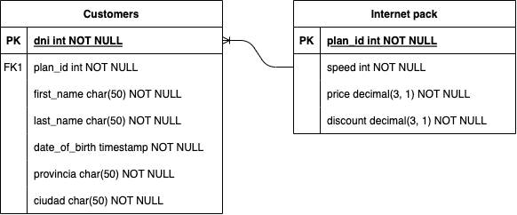

# DER y SQL

## Objetivo

El objetivo de esta guía práctica es poder integrar los contenidos de bases de datos relacionales vistos hasta este momento. Para ello, se propone la siguiente práctica.

> ¡Buena suerte!  

## *Escenario*

Una empresa proveedora de Internet necesita una base de datos para almacenar cada uno de sus clientes junto con el plan/pack que tiene contratado.
Mediante un análisis previo se conoce que se tiene que almacenar la siguiente información:
* De los clientes se debe registrar: dni, nombre, apellido, fecha de nacimiento, provincia, ciudad.
* En cuanto a los planes de internet: identificación del plan, velocidad ofrecida en megas, precio, descuento.

### *Ejercicio 1*

Luego del planteo de los requerimientos de la empresa, se solicita modelar los mismos mediante un DER (Diagrama Entidad-Relación).

### *Ejercicio 2*

Una vez modelada y planteada la base de datos, responder a las siguientes preguntas:

a. ¿Cuál es la primary key para la tabla de clientes? Justificar respuesta

* La llave primaria considerada será el campo `dni` ya que es un número único que no cambiará como identificación del cliente

b. ¿Cuál es la primary key para la tabla de planes de internet? Justificar respuesta.

* La llave primaria considerada será el campo `plan_id` ya que es un número podria considerarse único 

c. ¿Cómo serían las relaciones entre tablas? ¿En qué tabla debería haber foreign key? ¿A qué campo de qué tabla hace referencia dicha foreign key? Justificar respuesta.

*_Relaciones_*

* 1 cliente solo puede contratar un servicio un plan con la compañia IT
* 1 paquete puede tenerlo muchos clientes
        

