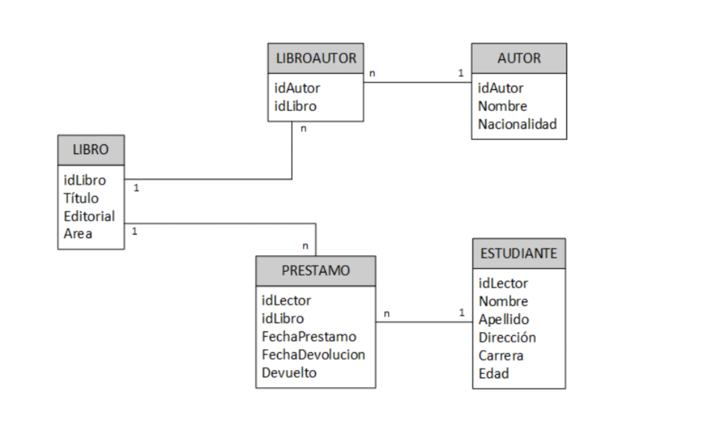

# Advanced SQL queries

## *Ejercicio 1*



Se tiene el siguiente DER que corresponde al esquema que presenta la base de datos de una “biblioteca”.

En base al mismo, *planteae las consultas SQL* para resolver los siguientes requerimientos:

1. Listar los datos de los autores.

```sql
mysql> SELECT * FROM author;
+-----------+--------+-------------+
| author_id | name   | nationality |
+-----------+--------+-------------+
|     12341 | Ramiro | Venezolana  |
|     12342 | Jack   | Stroker     |
|     12343 | Albert | Gogol       |
|     12344 | Emily  | Fuentes     |
|     12345 | Ray    | Soledad     |
+-----------+--------+-------------+
5 rows in set (0.00 sec)
```

2. Listar nombre y edad de los estudiantes

```sql
mysql> SELECT first_name, last_name, age FROM student;
+------------+-----------+-----+
| first_name | last_name | age |
+------------+-----------+-----+
| Ramiro     | Lozada    |  22 |
| Jack       | Stroker   |  28 |
| Albert     | Gogol     |  32 |
| Emily      | Fuentes   |  42 |
| Ray        | Soledad   |  28 |
+------------+-----------+-----+
5 rows in set (0.00 sec)
```

3. ¿Qué estudiantes pertenecen a la carrera informática?

```sql

mysql> SELECT first_name, last_name, age FROM student WHERE career = 'nurse';
+------------+-----------+-----+
| first_name | last_name | age |
+------------+-----------+-----+
| Ramiro     | Lozada    |  22 |
+------------+-----------+-----+
1 row in set (0.00 sec)
```

4. ¿Qué autores son de nacionalidad francesa o italiana?

```sql
mysql> SELECT * FROM author WHERE nationality = 'Venezolana' OR nationality = 'Soledad';
+-----------+--------+-------------+
| author_id | name   | nationality |
+-----------+--------+-------------+
|     12341 | Ramiro | Venezolana  |
|     12345 | Ray    | Soledad     |
+-----------+--------+-------------+
2 rows in set (0.01 sec)
```

5. ¿Qué libros no son del área de internet?

```sql
mysql> SELECT * FROM book WHERE area = 'narrativo';
+---------+--------------+--------------+-----------+
| book_id | title        | editorial    | area      |
+---------+--------------+--------------+-----------+
|    1235 | Rojo y negro | Copy Editors | narrativo |
+---------+--------------+--------------+-----------+
1 row in set (0.00 sec)
```

6. Listar los libros de la editorial Salamandra.

```sql
mysql> SELECT title FROM book WHERE editorial = 'Query Letter';
+--------------+
| title        |
+--------------+
| En el camino |
+--------------+
1 row in set (0.00 sec)
```


7. Listar los datos de los estudiantes cuya edad es mayor al promedio.

```sql
mysql> SELECT first_name, AVG(age) FROM student GROUP BY first_name;
+------------+----------+
| first_name | AVG(age) |
+------------+----------+
| Ramiro     |  22.0000 |
| Jack       |  28.0000 |
| Albert     |  32.0000 |
| Emily      |  42.0000 |
| Ray        |  28.0000 |
+------------+----------+
5 rows in set (0.00 sec)

mysql>
mysql> SELECT first_name, AVG(age) promedio FROM student GROUP BY first_name HAVING promedio > 28;
+------------+----------+
| first_name | promedio |
+------------+----------+
| Albert     |  32.0000 |
| Emily      |  42.0000 |
+------------+----------+
2 rows in set (0.01 sec)
```

8. Listar los nombres de los estudiantes cuyo apellido comience con la letra G.

```sql
mysql> SELECT first_name, last_name FROM student WHERE last_name LIKE 'G%';
+------------+-----------+
| first_name | last_name |
+------------+-----------+
| Albert     | Gogol     |
+------------+-----------+
1 row in set (0.00 sec)
```

9. Listar los autores del libro “El Universo: Guía de viaje”. (Se debe listar solamente los nombres).

```sql
mysql> SELECT * FROM author au INNER JOIN bookauthor ba ON au.author_id = ba.author_id INNER JOIN book bo ON ba.book_id = bo.book_id
    -> ;
+-----------+--------+-------------+-----------+---------+---------+--------------+--------------+-----------+
| author_id | name   | nationality | author_id | book_id | book_id | title        | editorial    | area      |
+-----------+--------+-------------+-----------+---------+---------+--------------+--------------+-----------+
|     12341 | Ramiro | Venezolana  |     12341 |    1234 |    1234 | El buscon    | Soledad      | ficcion   |
|     12342 | Jack   | Stroker     |     12342 |    1234 |    1234 | El buscon    | Soledad      | ficcion   |
|     12342 | Jack   | Stroker     |     12342 |    1235 |    1235 | Rojo y negro | Copy Editors | narrativo |
|     12343 | Albert | Gogol       |     12343 |    1236 |    1236 | Drácula      | ProofReaders | poetico   |
|     12345 | Ray    | Soledad     |     12345 |    1237 |    1237 | En el camino | Query Letter | dramatico |
+-----------+--------+-------------+-----------+---------+---------+--------------+--------------+-----------+
5 rows in set (0.00 sec)

mysql>
ysql> SELECT au.name FROM author au INNER JOIN bookauthor ba ON au.author_id = ba.author_id INNER JOIN book bo ON ba.book_id = bo.book_id WHERE title = 'El buscon';

+--------+
| name   |
+--------+
| Ramiro |
| Jack   |
+--------+
2 rows in set (0.01 sec)
```

10. ¿Qué libros se prestaron al lector “Filippo Galli”?

```sql
mysql> SELECT * FROM book bo INNER JOIN booking book ON bo.book_id = book.book_id INNER JOIN student st ON st.student_id = book.student_id WHERE first_name = 'Ramiro';
+---------+--------------+--------------+-----------+------------+---------+---------------------+---------------------+----------+------------+------------+-----------+-----------------------------------+--------+-----+
| book_id | title        | editorial    | area      | student_id | book_id | loan_date           | return_date         | returned | student_id | first_name | last_name | address                           | career | age |
+---------+--------------+--------------+-----------+------------+---------+---------------------+---------------------+----------+------------+------------+-----------+-----------------------------------+--------+-----+
|    1234 | El buscon    | Soledad      | ficcion   |     123411 |    1234 | 2008-12-01 00:01:01 | 2008-12-23 00:01:01 |        0 |     123411 | Ramiro     | Lozada    | Calle Santo del Villagomez No. 81 | nurse  |  22 |
|    1235 | Rojo y negro | Copy Editors | narrativo |     123411 |    1235 | 2012-01-04 00:11:01 | 2013-12-01 00:01:01 |        0 |     123411 | Ramiro     | Lozada    | Calle Santo del Villagomez No. 81 | nurse  |  22 |
+---------+--------------+--------------+-----------+------------+---------+---------------------+---------------------+----------+------------+------------+-----------+-----------------------------------+--------+-----+
2 rows in set (0.00 sec)

mysql> SELECT bo.title, bo.editorial FROM book bo INNER JOIN booking book ON bo.book_id = book.book_id INNER JOIN student st ON st.student_id = book.student_id WHERE first_name = 'Ramiro' and book.returned = false;
+--------------+--------------+
| title        | editorial    |
+--------------+--------------+
| El buscon    | Soledad      |
| Rojo y negro | Copy Editors |
+--------------+--------------+
2 rows in set (0.01 sec)
```

11. Listar el nombre del estudiante de menor edad.

```sql
mysql> SELECT first_name, age FROM student ORDER BY age ASC;
+------------+-----+
| first_name | age |
+------------+-----+
| Ramiro     |  22 |
| Jack       |  28 |
| Ray        |  28 |
| Albert     |  32 |
| Emily      |  42 |
+------------+-----+
5 rows in set (0.00 sec)

mysql>
mysql> SELECT first_name, age FROM student ORDER BY age ASC LIMIT 1;
+------------+-----+
| first_name | age |
+------------+-----+
| Ramiro     |  22 |
+------------+-----+
1 row in set (0.00 sec)
```

12. Listar nombres de los estudiantes a los que se prestaron libros de Base de Datos.

```sql
mysql> SELECT st.first_name, bo.title, returned FROM book bo INNER JOIN booking book ON bo.book_id = book.book_id INNER JOIN student st ON st.student_id = book.student_id WHERE book.returned = true;
+------------+--------------+----------+
| first_name | title        | returned |
+------------+--------------+----------+
| Jack       | Rojo y negro |        1 |
| Albert     | Drácula      |        1 |
+------------+--------------+----------+
2 rows in set (0.00 sec)
```

13. Listar los libros que pertenecen a la autora J.K. Rowling.

```sql
mysql> SELECT bo.title FROM author au INNER JOIN bookauthor ba ON au.author_id = ba.author_id INNER JOIN book bo ON ba.book_id = bo.book_id WHERE au.name = 'Ramiro';
+-----------+
| title     |
+-----------+
| El buscon |
+-----------+
1 row in set (0.00 sec)
```

14. Listar títulos de los libros que debían devolverse el 16/07/2021.

```sql
mysql> SELECT * FROM book bo INNER JOIN booking book ON bo.book_id = book.book_id WHERE book.loan_date < '2008-12-01' and returned = false;
+---------+--------------+--------------+-----------+------------+---------+---------------------+---------------------+----------+
| book_id | title        | editorial    | area      | student_id | book_id | loan_date           | return_date         | returned |
+---------+--------------+--------------+-----------+------------+---------+---------------------+---------------------+----------+
|    1237 | En el camino | Query Letter | dramatico |     123455 |    1237 | 2003-09-03 00:01:10 | 2004-12-01 00:01:01 |        0 |
+---------+--------------+--------------+-----------+------------+---------+---------------------+---------------------+----------+
1 row in set (0.00 sec)

```


## Run

* Import database sql script

```bash
$ mysql -uroot -p < ./database/company.sql
Enter password:
$
```

* Interative with my new database

```bash
$ mysql -uroot -p
Enter password:
Welcome to the MySQL monitor.  Commands end with ; or \g.
Your MySQL connection id is 11
Server version: 8.0.31 Homebrew

Copyright (c) 2000, 2022, Oracle and/or its affiliates.

Oracle is a registered trademark of Oracle Corporation and/or its
affiliates. Other names may be trademarks of their respective
owners.

Type 'help;' or '\h' for help. Type '\c' to clear the current input statement.

mysql> SHOW DATABASES;
+--------------------+
| Database           |
+--------------------+
| information_schema |
| library            |
| melisprint         |
| movies_db          |
| mysql              |
| performance_schema |
| sys                |
+--------------------+
6 rows in set (0.00 sec)

mysql> USE movies_db;

...
```
