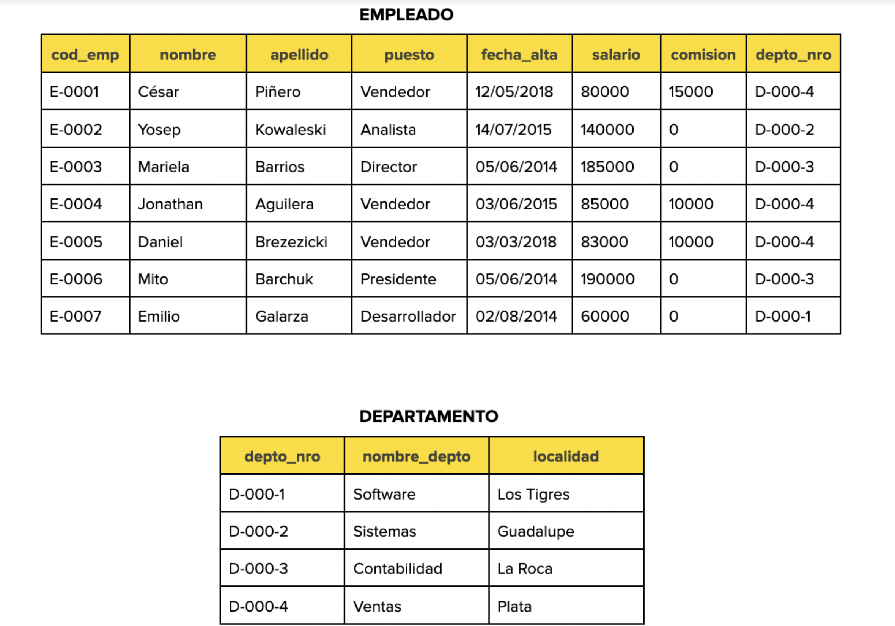

# Advanced SQL queries

## *Ejercicio 2*


Teniendo las tablas de una base de datos de una empresa:



Se requiere obtener las siguientes consultas:

1. Seleccionar el nombre, el puesto y la localidad de los departamentos donde trabajan los vendedores.

```sql
mysql> SELECT e.first_name, e.position, d.locality FROM employee e INNER JOIN departament d ON e.depto_nro = d.depto_nro WHERE position = 'Vendedor';
+------------+----------+----------+
| first_name | position | locality |
+------------+----------+----------+
| Cesar      | Vendedor | Plata    |
| Jonathan   | Vendedor | Plata    |
| Daniel     | Vendedor | Plata    |
+------------+----------+----------+
3 rows in set (0.00 sec)

mysql>
```

2. Visualizar los departamentos con más de cinco empleados.

```sql
mysql> SELECT COUNT(*), position FROM employee e INNER JOIN departament d ON e.depto_nro = d.depto_nro GROUP BY e.position;
+----------+---------------+
| COUNT(*) | position      |
+----------+---------------+
|        1 | Desarrollador |
|        1 | Analista      |
|        1 | Director      |
|        1 | Presidente    |
|        3 | Vendedor      |
+----------+---------------+
5 rows in set (0.00 sec)

mysql> SELECT COUNT(*) nro_employee, position FROM employee e INNER JOIN departament d ON e.depto_nro = d.depto_nro GROUP BY e.position HAVING nro_employee > 5;
Empty set (0.01 sec)
```

3. Mostrar el nombre, salario y nombre del departamento de los empleados que tengan el mismo puesto que ‘Mito Barchuk’.

```sql
mysql> SELECT * FROM employee e INNER JOIN departament d ON e.depto_nro = d.depto_nro WHERE d.name_depto = 'Contabilidad' AND e.position != 'Presidente';
+---------+------------+-----------+----------+---------------------+--------+-----------+-----------+-----------+--------------+----------+
| cod_com | first_name | last_name | position | alta_date           | salary | comission | depto_nro | depto_nro | name_depto   | locality |
+---------+------------+-----------+----------+---------------------+--------+-----------+-----------+-----------+--------------+----------+
| E-0003  | Mariela    | Barrios   | Director | 2014-06-05 00:40:01 | 185000 |         0 | D-000-3   | D-000-3   | Contabilidad | La Roca  |
+---------+------------+-----------+----------+---------------------+--------+-----------+-----------+-----------+--------------+----------+
1 row in set (0.00 sec)

mysql>
```

4. Mostrar los datos de los empleados que trabajan en el departamento de contabilidad, ordenados por nombre.

```sql
mysql> SELECT * FROM employee e INNER JOIN departament d ON e.depto_nro = d.depto_nro WHERE d.name_depto = 'Contabilidad' ORDER BY first_name;
+---------+------------+-----------+------------+---------------------+--------+-----------+-----------+-----------+--------------+----------+
| cod_com | first_name | last_name | position   | alta_date           | salary | comission | depto_nro | depto_nro | name_depto   | locality |
+---------+------------+-----------+------------+---------------------+--------+-----------+-----------+-----------+--------------+----------+
| E-0003  | Mariela    | Barrios   | Director   | 2014-06-05 00:40:01 | 185000 |         0 | D-000-3   | D-000-3   | Contabilidad | La Roca  |
| E-0006  | Mito       | Barchuck  | Presidente | 2014-06-05 00:40:01 | 190000 |         0 | D-000-3   | D-000-3   | Contabilidad | La Roca  |
+---------+------------+-----------+------------+---------------------+--------+-----------+-----------+-----------+--------------+----------+
2 rows in set (0.00 sec)

mysql>
```

5. Mostrar el nombre del empleado que tiene el salario más bajo.

```sql
mysql> SELECT * FROM employee e INNER JOIN departament d ON e.depto_nro = d.depto_nro ORDER BY salary ASC LIMIT 1;
+---------+------------+-----------+---------------+---------------------+--------+-----------+-----------+-----------+------------+------------+
| cod_com | first_name | last_name | position      | alta_date           | salary | comission | depto_nro | depto_nro | name_depto | locality   |
+---------+------------+-----------+---------------+---------------------+--------+-----------+-----------+-----------+------------+------------+
| E-0007  | Emilio     | Gazalarza | Desarrollador | 2014-08-02 00:40:01 |  60000 |         0 | D-000-1   | D-000-1   | Software   | Los Tigres |
+---------+------------+-----------+---------------+---------------------+--------+-----------+-----------+-----------+------------+------------+
1 row in set (0.01 sec)

mysql>
```


6. Mostrar los datos del empleado que tiene el salario más alto en el departamento de ‘Ventas’.

```sql
mysql> SELECT * FROM employee e INNER JOIN departament d ON e.depto_nro = d.depto_nro WHERE name_depto = 'Ventas' ORDER BY salary DESC LIMIT 1;
+---------+------------+-----------+----------+---------------------+--------+-----------+-----------+-----------+------------+----------+
| cod_com | first_name | last_name | position | alta_date           | salary | comission | depto_nro | depto_nro | name_depto | locality |
+---------+------------+-----------+----------+---------------------+--------+-----------+-----------+-----------+------------+----------+
| E-0004  | Jonathan   | Aguilera  | Vendedor | 2015-06-03 00:40:01 |  85000 |     10000 | D-000-4   | D-000-4   | Ventas     | Plata    |
+---------+------------+-----------+----------+---------------------+--------+-----------+-----------+-----------+------------+----------+
1 row in set (0.01 sec)

mysql>
```


## Run

* Import database sql script

```bash
$ mysql -uroot -p < ./database/company.sql
Enter password:
$
```

* Interative with my new database

```bash
$ mysql -uroot -p
Enter password:
Welcome to the MySQL monitor.  Commands end with ; or \g.
Your MySQL connection id is 35
Server version: 8.0.31 Homebrew

Copyright (c) 2000, 2022, Oracle and/or its affiliates.

Oracle is a registered trademark of Oracle Corporation and/or its
affiliates. Other names may be trademarks of their respective
owners.

Type 'help;' or '\h' for help. Type '\c' to clear the current input statement.

mysql>
mysql> SHOW TABLES;
ERROR 1046 (3D000): No database selected
mysql>
mysql> SHOW DATABASES;
+--------------------+
| Database           |
+--------------------+
| company            |
| empresa_internet   |
| information_schema |
| library            |
| melisprint         |
| movies_db          |
| mysql              |
| performance_schema |
| sys                |
+--------------------+
9 rows in set (0.00 sec)

mysql> USE company;
Reading table information for completion of table and column names
You can turn off this feature to get a quicker startup with -A

Database changed
mysql>
mysql> SHOW TABLES;
+-------------------+
| Tables_in_company |
+-------------------+
| departament       |
| employee          |
+-------------------+
2 rows in set (0.01 sec)

mysql>

```


