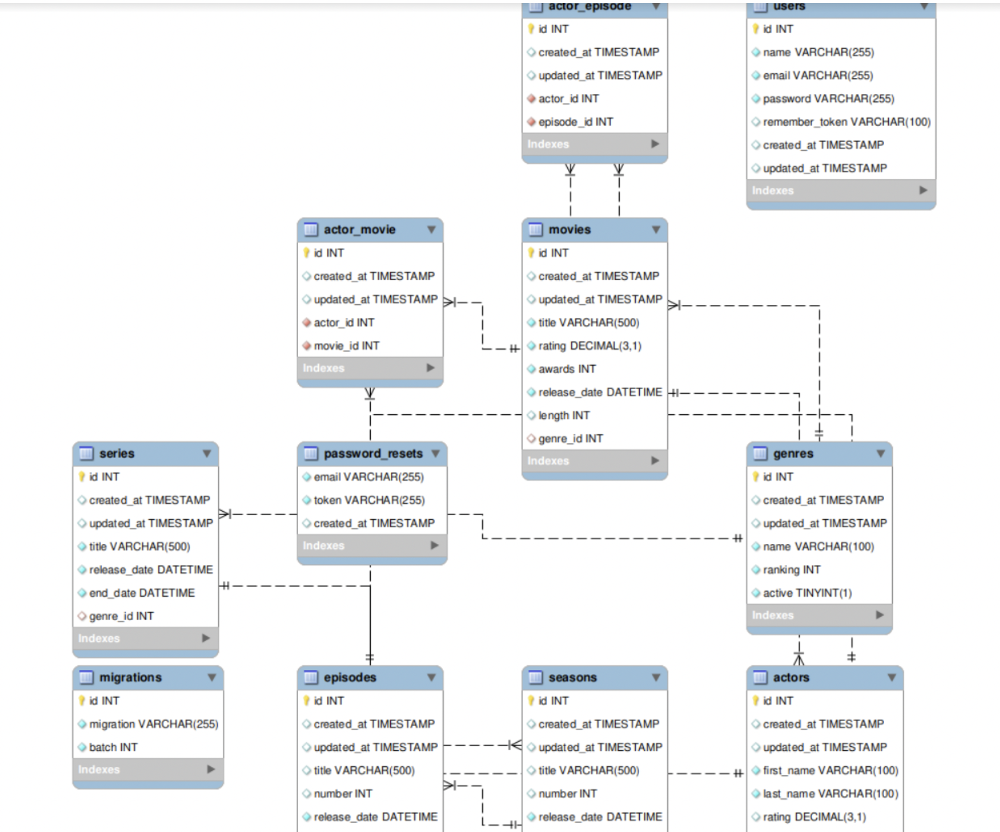
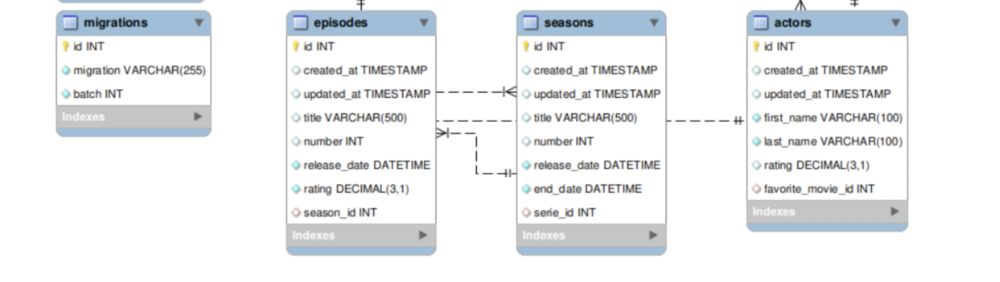

# Practice in Class 

## *Ejercicio 1*



---

<br>

---



1. Con la base de datos `movies`, se propone crear una tabla temporal llamada `TWD` y guardar en la misma los episodios de todas las temporadas de `The Walking Dead`.

* Contruimos la consulta de los datos que serán volcados en la tabla temporal

```sql
SELECT * FROM episodes e
INNER JOIN seasons s ON e.season_id = s.id = (
    SELECT id FROM series WHERE title = 'The Walking Dead' 
);
```

---

* Creamos la tabla `TWD` con el esquema que nos trae la consulta

```sql
CREATE TEMPORARY TABLE TWD
SELECT * FROM episodes e
INNER JOIN seasons s ON e.season_id = s.id = (
    SELECT id FROM series WHERE title = 'The Walking Dead' 
);
```

* Mostrar la tabla `TWD`  

```sql
SHOW CREATE TABLE TWD
```

   * Nos daremos cuenta que la tabla temporal no tiene indices, no tiene *PK*
   * Si queremos tener una copia con los indices y *PK* podemos usar `LIKE` statement

        ```sql
        DROP TABLE IF EXIST testing;
        CREATE TEMPORARY TABLE testing LIKE episodes;
        SHOW CREATE TABLE testing;
        ```

        * Es útil cuando queremos hacer un JOIN de multiples tablas donde tenemos muchas columnas repetidas, con PK repetidas entoonces de esta manera nos aseguramos que no tenga conflictos, si lo hacemos con `SELECT` statement nos traería estos problemas.


---

2. Realizar una consulta a la tabla temporal para ver los episodios de la primera temporada.


   ```sql
   SELECT * FROM TWD ORDER BY id DESC;
   ```


